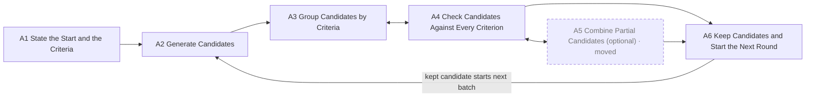
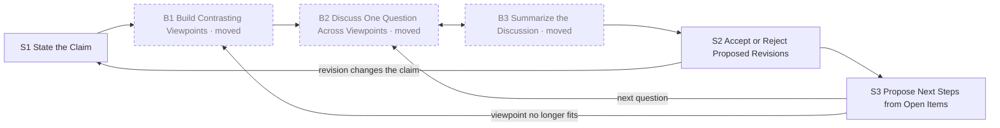
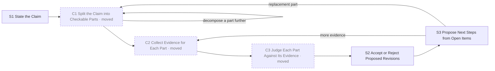

# Pattern Language — MVP (9/22)

> Goal: a minimal pattern language that abstracts the four exemplar systems in `data/` (HALO,
> HAPPIER, PerspectEvolver, THESEUS). Nothing beyond that scope. Source readings:
> `exemplar-systems-review.md`; structure from Borchers (`borchers-translation.md`).
> § numbers refer to each paper's system section.

<!-- <xac: note that i do not assume all the four system papers in data/ fit one pattern. they could be four patterns, or three, or two. patterns are also hierarchical so some of them might share one pattern at workflow but exhibit different patterns at subtasks or components.>
  - Revised twice; now **three workflow patterns**: HALO + HAPPIER share one, PerspectEvolver
    and THESEUS have one each and share three subtasks. See "How the four systems divide". -->

## Structure

Three levels, linked by Borchers's context (up) and references (down):

- **Workflow**: the sequence of subtasks a user performs with the system to achieve the
  high-level task. A workflow can branch and loop.
- **Subtask**: one step in that sequence, for example filter generated ideas. Its solution is a
  sequence of steps in which the user works with components.
- **Component**: a UI element or interaction that supports a subtask.

Every pattern lists its instances. The four papers do not have to share every level.

**Two systems or more.** The MVP shows a subtask or a component only when it applies to two or
more systems. A single-system pattern is in [single-system-patterns.md](single-system-patterns.md)
until a new system shows it. A workflow can rest on one system, for now. Component counts include
the moved subtasks.

**Level of abstraction.** The name, problem, and solution of a pattern use no term that belongs
to one exemplar system or its domain. Domain terms appear in Examples only. Test: put a system
from another domain in the pattern. Only the Examples change.

**No assumption of AI.** A pattern states what the system does. The four exemplars use AI models
to generate, to score, and to interpret. A pattern also holds when a solver, a database, or a
person produces the content. AI appears in Examples only.

**Writing style.** Pattern text follows ASD-STE100 Simplified Technical English, in the
document-mode form of https://github.com/AminBlg/SimpleEnglish:

- 20 words maximum per instruction. 25 words maximum per description.
- State the condition before the command.
- Use active voice and simple tenses.
- Use *can*, *will*, and *must*. Do not use *should*, *would*, *may*, or *might*.
- Use one word for one meaning in the whole document. The fixed terms are: system, user, item,
  candidate, criterion, group, part, viewpoint, evidence, outcome, record, claim, show, open,
  select, keep, accept, reject, propose, link.
- State the fact, not its importance.
- Two deviations, both deliberate. Field labels (**Problem:**, **Solution:**) stay bold, because
  they are the schema of a pattern and not decoration. A component name keeps its CP number in a
  step, so that a reader can follow the reference.

**Component rules** (9/29). Apply them in this order when a component is added or checked:

1. *Reuse.* A component serves two or more subtasks. Count the uses from the subtask Solution
   steps, not by hand.
2. *Extend.* When a component serves one subtask, look at the Examples of the other subtasks.
   When an exemplar shows the same UI there, add the step to that subtask.
3. *Merge.* When the component is a narrower case of another component, merge it. State the
   narrower case as a variation of the other component.
4. *Demote.* When neither applies, remove the component. The step states the action and says
   "(no component)". The UI stays open.
5. *Promote.* When a "(no component)" need occurs in two or more subtasks, make it a component.

A retired ID is not used again.

IDs: workflows `WF-A/B/C` · subtasks `A1…`, `B1…`, `C1…`, shared ones `S1…` · components `CP-1…`.

## Template

| Field | Holds |
|---|---|
| **Name** | A short noun phrase. It is the shared vocabulary item |
| **Level** | workflow, subtask, or component |
| **Context** | The parent patterns that this pattern helps to implement |
| **Problem** | Two labelled parts. *Goal:* what the user sets out to achieve. *Failure:* what goes wrong without the pattern |
| **Solution** | How to build the pattern into a design, in terms that hold in any domain. It uses the patterns of the next level down as building blocks. Workflow: a diagram of the subtasks, then one line per subtask. Subtask: steps that each start with the component used, "CP-n Name: action". A step that fits no component says "(no component)". Component: an eigen-UI card (see Components) |
| **Examples** | How each exemplar system instantiates the pattern, with its § section |
| **References** | The child patterns that implement this pattern |

<!-- <xac: for solution: each level's solution should use patterns in the next lower level as building blocks: workflow already does this well; subtasks need to tie closer to components; components have no lower-level patterns to use and is largely based on the eigen-UI, which is fine>
  - Adopted. Every subtask step now starts with its component. Four steps fit no component, and
    say "(no component)": a viewpoint with fixed fields (B1), a record of a discussion (B3), an
    editable procedure (C2), and a verdict (C3). Later, 9/29: a component must serve two or more
    subtasks. The fixed fields occur in B1 and C1, so they are now CP-17 Typed Item. The other
    three occur once, and stay as steps with no component. -->

**A component serves two or more subtasks.** When a need occurs in one subtask only, the step
states the action and says "(no component)". The step leaves the UI open. Three needs are like
this: a record of a discussion (B3), an editable procedure (C2), and a verdict (C3).

<!-- <xac: need a better language to define this. here solution should describe how to implement this pattern into specific designs in a general tone>
  - Redefined as above. Every Solution below is rewritten as instructions, with the design
    choices named ("Choose…", "Decide…"). -->

<!-- <xac: perhaps defer this attribute? i don't feel like i care about trade-off when viewing a pattern for the first pass>
  - Deferred. Tradeoff is removed from the template and from every pattern; the earlier text is
    in git if a later pass wants it. -->

(Deferred for the MVP: Borchers's tradeoff/forces, diagram, picture, and ranking.)

---

## How the four systems divide

Three workflow patterns. WF-B and WF-C share half of their subtasks. WF-A stands apart.

| | WF-A Guided Candidate Search | WF-B Multi-Viewpoint Refinement | WF-C Decompose and Verify |
|---|---|---|---|
| Systems | HALO, HAPPIER | PerspectEvolver | THESEUS |
| The user works on | a population of candidates | one position, against contrasting viewpoints | one claim, in checkable parts |
| New input comes from | generated candidates and their scores | viewpoints that argue from source material | evidence the user collects outside the system |
| Progress is | fewer candidates, each one stronger | a sharper position, or a named disagreement | evidence per part, and a revised structure |

**Alternatives considered.** One workflow for all four systems puts two different activities in
one shape: to screen a population, and to revise a claim. Two workflows, with PerspectEvolver
and THESEUS together, fail at two subtasks. To form contrasting viewpoints is not to decompose
a claim into parts. A generated argument is not evidence from the world. The split below states
the shared part as three shared subtasks: S1, S2, and S3.

---

## Workflow patterns

### WF-A · Guided Candidate Search
- **Context:** — (top level)
- **Problem:**
  - *Goal:* The user finds candidates that satisfy several criteria at once.
  - *Failure:* The space is too large to search by hand. Each criterion is in a separate tool,
    and the user checks candidates one at a time.
- **Solution:** Support this sequence of subtasks:

  1. A1 State the Start and the Criteria. The user gives the starting point and each criterion.
  2. A2 Generate Candidates. The system returns a batch of candidates from the criteria.
  3. A3 Group Candidates by Criteria. The system groups candidates by their scores.
  4. A4 Check Candidates Against Every Criterion. The user checks groups and candidates.
  5. A5 Combine Partial Candidates. Optional. Include it when the domain lets candidates combine.
  6. A6 Keep Candidates and Start the Next Round. A kept candidate starts the next round.

- **Examples:**

  | Subtask | HALO | HAPPIER |
  |---|---|---|
  | A1 State the Start and the Criteria | initial molecule and 4 target properties | initial protein, therapeutic impact, ligand |
  | A2 Generate Candidates | generative model, dozens of molecules (§4.1) | interaction graph, 10 subgraphs (§5.1) |
  | A3 Group Candidates by Criteria | clusters by improved and worsened properties (§4.1) | subgraphs ranked by interaction potential (§5.1) |
  | A4 Check Candidates Against Every Criterion | cluster overview and candidates table with deltas (§4.2) | criteria sliders and detail panel (§5.1–5.2) |
  | A5 Combine Partial Candidates | intra-cluster and inter-cluster strategies, then the editor (§4.2–4.3) | skipped |
  | A6 Keep Candidates and Start the Next Round | save, new tree node, next generation (§4.3) | bookmark, personal PPI graph (§5.2.1) |

- **References:** A1–A6.
<!-- <xac: ideally, if two system shares the same workflow, they can both be abstracted as a single "A->B->C->D-> ...">
  - Done: both systems are now one chain, A1 → … → A6. The table shows how each system fills
    each step; HAPPIER skips the optional A5. WF-B uses the same form. -->

### WF-B · Multi-Viewpoint Refinement
- **Context:** — (top level)
- **Problem:**
  - *Goal:* The user develops a claim, and tests it against viewpoints that differ from the
    user's own.
  - *Failure:* People who hold other viewpoints are hard to reach. Generated viewpoints read
    alike and cite nothing.
- **Solution:** Support this sequence of subtasks:

  1. S1 State the Claim. The user states the claim and its basis.
  2. B1 Build Contrasting Viewpoints. The system builds viewpoints from source material. The
     user keeps a working set.
  3. B2 Discuss One Question Across Viewpoints. Each contribution names its viewpoint.
  4. B3 Summarize the Discussion. The system records what holds, what conflicts, and what stays
     open.
  5. S2 Accept or Reject Proposed Revisions. The record becomes proposed revisions to the
     viewpoints and the claim.
  6. S3 Propose Next Steps from Open Items. Each open item becomes a proposed next question.

- **Examples:** PerspectEvolver. Investigation Brief (§4.1.1). Literature regions, then
  Perspective Cards with six fields; the user selects 2 or 3 (§4.1.2–4.1.3). Deliberative
  Threads with @-mention, Challenge, and Expand (§4.2.2). Working Synthesis (§4.2.3). Revision
  cards and brief Accept/Edit/Reject (§4.3.1–4.3.2). Suggested Threads (§4.3.3).
- **References:** S1, B1–B3, S2, S3.

### WF-C · Decompose and Verify
- **Context:** — (top level)
- **Problem:**
  - *Goal:* The user checks a claim with evidence that arrives one piece at a time.
  - *Failure:* One check does not settle the claim. In linear notes the user loses which check
    applies to which part, and why the check ran.
- **Solution:** Support this sequence of subtasks:

  1. S1 State the Claim. The user states the claim to check.
  2. C1 Split the Claim into Checkable Parts. The system proposes parts with rationale. The user
     edits the structure.
  3. C2 Collect Evidence for Each Part. The user edits a procedure per part, runs it, and reports
     outcomes.
  4. C3 Judge Each Part Against Its Evidence. The system reports what the outcome does to that
     part.
  5. S2 Accept or Reject Proposed Revisions. The judgement becomes proposed changes to the parts.
  6. S3 Propose Next Steps from Open Items. An open part becomes another check or a replacement
     part.

- **Examples:** THESEUS. Main hypothesis and decomposition depth (§4.1). Sub-hypothesis graph
  with rationale and edge confidence (§4.1). Experiment families, editable protocols, CSV result
  upload (§4.2). Three-reviewer interpretation label (§4.3). Adopt one of three candidates, and
  pending drafts (§4.3–4.4). Further experiment, or replace hypothesis (§4.3).
- **References:** S1, C1–C3, S2, S3.

<!-- <xac: feel like these two systems' connection with each other is looser than halo and happier. esp. 1) THESEUS doesn't really maintain a working artifact; and 2) for B3 and B4, the two systems' instantiations feel quite different. overall i wonder if they belong to different patterns>
  - Agreed, and split: WF-B (PerspectEvolver) and WF-C (THESEUS) are now separate workflows.
    They share three subtasks (S1, S2, S3) and nine components, which is where the real overlap
    was. "Evolving Working Artifact" survives only as CP-4 Persistent Structure Map. -->

<!-- <xac: WF-B&C's level of abstraction seems lower (more specific) than WF-A, which i feel has the appropriate amount of generalizability balanced with groundedness (in the example papers)>
  - Fixed. Both were written in their one system's vocabulary ("perspective", "hypothesis",
    "experiment"). Raised to WF-A's level, and the rule is stated under "Structure": no term
    from one exemplar or its domain outside the Examples field. -->

<!-- <xac: just want to re-iterate that we do not assume workflow is linear: it can branch out and it can form loops (a mermaid diagram is better suited for describing it in general?)>
  - Adopted: each workflow's Solution now leads with a mermaid flowchart showing branches and
    loops, with the numbered list as the reading order. -->

---

## Shared subtasks (WF-B and WF-C)

### S1 · State the Claim
<!-- <xac: not a big fan of this type of metaphorical language. a subtask's name needs to be precise about what a specific action (which can generalize across tools) takes place>
  - Adopted for all 15 subtasks: a verb and its object, no metaphor. IDs are unchanged. The
    rename table is in the journal, 9/29. Workflow names are unchanged. -->

- **Context:** WF-B, WF-C
- **Problem:**
  - *Goal:* The user states the claim that the later work serves.
  - *Failure:* The claim stays in the mind of the user. Later work drifts, and no contribution
    can be checked against the claim.
- **Solution:**
  1. CP-1 Inquiry Frame: show one field per aspect of the claim.
  2. CP-1 Inquiry Frame: the user fills the fields. The system can draft a field, and the user
     edits the draft.
  3. CP-1 Inquiry Frame: keep the frame visible. Every later subtask reads it.
  4. CP-11 Reviewable Revision: when later work implies a change to the claim, show the change.
  5. CP-11 Reviewable Revision: the frame changes when the user accepts, and at no other time.
- **Examples:** PerspectEvolver Investigation Brief: problem, framing, previous work,
  methodology, and expected results. It stays editable, and revisions arrive through
  Accept/Edit/Reject (§4.1.1, §4.3.2). THESEUS main hypothesis and decomposition depth (§4.1).
- **References:** CP-1 Inquiry Frame, CP-11 Reviewable Revision.

<!-- <xac: there is an assumption here that this is for interacting with AI?>
  - Removed. The language is now AI-neutral: patterns say "the system". See "No assumption of
    AI" under Structure. -->

<!-- <xac: the description here lack operationalizability; it should consists of steps where the user interacts with certain patterns of components to accomplish this subtask>
  - Adopted. Every subtask Solution below is now numbered steps, each naming the components
    (CP-n) the user works with. -->

### S2 · Accept or Reject Proposed Revisions
- **Context:** WF-B, WF-C
- **Problem:**
  - *Goal:* The user takes changes from the system and keeps control of the work.
  - *Failure:* When the system edits the work directly, the user cannot see the change. When the
    system drafts nothing, the user gains little.
<!-- <xac: rather than a free-form prose, we need a pre-defined structure for specifying the problem. problem is defined as "What the user does, and what fails without the pattern"---does that mean the two attributes are goal (what to achieve) and failure (what fails)>
  - Yes. Problem now has two labelled parts, *Goal* and *Failure*, in every workflow, subtask,
    and component. See Template. -->

<!-- <xac: language like this seems too casual, mystic, and imprecise. check this and see if we can adopt its style: https://github.com/AminBlg/SimpleEnglish>
  - Adopted, document mode, for all pattern text: 20-word instructions, condition before
    command, active voice, no should/would/may/might, one word per meaning, fact not importance.
    The rules and the two deviations are under "Writing style". -->
- **Solution:**
  1. CP-11 Reviewable Revision: when the previous subtask implies one change, draft it. Show
     before, after, and the reason. Apply nothing.
  2. CP-10 Proposal Set: when several directions are open, show each option with a label and its
     rationale.
  3. CP-11 Reviewable Revision: the user accepts, edits, or rejects each change. Only this action
     changes the work.
  4. CP-14 Provenance Link: keep the replaced content, and link it to its successor.
  5. CP-11 Reviewable Revision: when the item changed after the draft, reject the draft.
- **Examples:** PerspectEvolver revision cards and brief Accept/Edit/Reject. Participants
  accepted 70% as drafted, edited 28%, and rejected 2% (§4.3.1–4.3.2). THESEUS adopts one
  candidate of three. It rejects a pending draft when the graph changed under it (§4.3–4.4).
- **References:** CP-10 Proposal Set, CP-11 Reviewable Revision, CP-14 Provenance Link.

### S3 · Propose Next Steps from Open Items
- **Context:** WF-B, WF-C
- **Problem:**
  - *Goal:* The user continues from what a round left open.
  - *Failure:* A round ends with a disagreement or an inconclusive outcome. The user stops, or
    the open item is lost.
- **Solution:**
  1. CP-10 Proposal Set: collect the items that the round left open. Show each item as an
     option, unopened.
  2. CP-14 Provenance Link: link each item to the item that raised it.
  3. CP-10 Proposal Set: when the user opens one item, go to the subtask that the item needs.
- **Examples:** PerspectEvolver builds Suggested Threads from open questions, and shows them as
  prospective canvas branches (§4.3.3). THESEUS offers three candidates each for "replace
  hypothesis" and "further experiment" (§4.3).
- **References:** CP-10 Proposal Set, CP-14 Provenance Link.

---

## Subtasks — WF-A · Guided Candidate Search

### A1 · State the Start and the Criteria
- **Context:** WF-A
- **Problem:**
  - *Goal:* The user gives the starting point and the criteria that later subtasks use.
  - *Failure:* The criteria are in the notes of the user, or in separate tools. Generation and
    checks cannot read them.
- **Solution:**
  1. CP-1 Inquiry Frame: show a field for the starting point, and one field per criterion.
  2. CP-1 Inquiry Frame: use the format of the domain for each field.
  3. CP-1 Inquiry Frame: the user fills each field. Flag a field that a later subtask requires.
  4. CP-1 Inquiry Frame: keep the fields visible. A2, A3, and A4 read them.
- **Examples:** HALO: initial molecule and four target properties. HAPPIER: initial protein,
  therapeutic impact, and ligand, one input per criterion (§5.1).
- **References:** CP-1 Inquiry Frame.

### A2 · Generate Candidates
- **Context:** WF-A
- **Problem:**
  - *Goal:* The user gets many candidates for the current criteria.
  - *Failure:* Manual search stays near familiar options, and it is slow.
- **Solution:**
  1. CP-1 Inquiry Frame: the user requests candidates from the current criteria.
  2. (no component): return a batch, not one answer. Size it so that the groups in A3 stay
     legible.
  3. CP-4 Persistent Structure Map: put each candidate on the map.
  4. CP-14 Provenance Link: link each candidate to the request that produced it.
  5. CP-1 Inquiry Frame: the user edits the criteria and requests another batch.
- **Examples:** HALO generates dozens of molecules and puts them on the trajectory map (§4.1).
  HAPPIER splits the interaction graph into 10 subgraphs of 50 to 60 proteins (§5.1).
- **References:** CP-1 Inquiry Frame, CP-4 Persistent Structure Map, CP-14 Provenance Link.

### A3 · Group Candidates by Criteria
- **Context:** WF-A
- **Problem:**
  - *Goal:* The user sees which candidates behave alike.
  - *Failure:* A flat list of hundreds of candidates hides which candidates behave alike.
- **Solution:**
  1. CP-3 Candidate Groups: choose a grouping signature from the criteria, not from the
     generation order.
  2. CP-3 Candidate Groups: form the groups. Label each group and summarize it.
  3. CP-5 Multi-Criteria Encoding: mark each group by its result on each criterion.
  4. CP-4 Persistent Structure Map: show the groups on the map.
  5. CP-6 Detail on Demand: when the user selects a group, list its candidates.
- **Examples:** HALO clusters candidates by improved and worsened properties, in green and red
  (§4.1). HAPPIER ranks subgraphs by interaction potential, and a slider switches between them
  (§5.1).
- **References:** CP-3 Candidate Groups, CP-4 Persistent Structure Map, CP-5 Multi-Criteria
  Encoding, CP-6 Detail on Demand.

### A4 · Check Candidates Against Every Criterion
- **Context:** WF-A
- **Problem:**
  - *Goal:* The user finds the candidates that satisfy every criterion.
  - *Failure:* The user checks each criterion in a separate tool. A generated score can be
    wrong, and the user cannot tell.
- **Solution:**
  1. CP-5 Multi-Criteria Encoding: show every criterion on one view. Give each criterion one
     visual channel and one toggle.
  2. CP-8 Confidence Cue: when the system generated a score, show the cue beside it.
  3. CP-6 Detail on Demand: when the user selects a candidate, open its detail.
  4. CP-7 Attached Evidence: show the evidence for each score in that detail.
  5. CP-5 Multi-Criteria Encoding: the user rejects candidates, then returns to A3 for the next
     group.
- **Examples:** HALO shows property deltas and a sortable candidates table (§4.2). HAPPIER shows
  criteria sliders, edge and node encoding, and a detail panel with papers and docking poses
  (§5.1–5.2).
- **References:** CP-5 Multi-Criteria Encoding, CP-6 Detail on Demand, CP-7 Attached Evidence,
  CP-8 Confidence Cue.

> A5 Combine Partial Candidates applies to one system. It is in
> [single-system-patterns.md](single-system-patterns.md#a5--combine-partial-candidates-1-system).

### A6 · Keep Candidates and Start the Next Round
- **Context:** WF-A
- **Problem:**
  - *Goal:* The user keeps the best candidates, and starts the next round from them.
  - *Failure:* Kept candidates spread across views. The next round starts from nothing.
- **Solution:**
  1. CP-12 Shortlist: give every candidate a keep action. Show the shortlist as its own view. It
     is the deliverable.
  2. CP-12 Shortlist: the user filters the shortlist by group.
  3. CP-14 Provenance Link: keep the link on each kept candidate.
  4. CP-1 Inquiry Frame: the user sends a kept candidate to A2 as the next starting point.
- **Examples:** HAPPIER bookmarks build a personal PPI graph, filterable by subgraph (§5.2.1).
  HALO saves a candidate as a node on the trajectory tree. That node starts the next generation
  (§4.3).
- **References:** CP-1 Inquiry Frame, CP-12 Shortlist, CP-14 Provenance Link.

---

## Subtasks — WF-B and WF-C

B1–B3 and C1–C3 apply to one system each. They are in
[single-system-patterns.md](single-system-patterns.md). WF-B and WF-C use them, and the diagrams
above mark them "moved".

---

## Components

**Used by more than one workflow:** CP-1, CP-3, CP-4, CP-6, CP-7, CP-8, CP-9, CP-10, CP-11, CP-12, CP-14, CP-17.

**Retired, 9/29:** CP-2 Candidate Batch, CP-15 Live Consequence Preview, and CP-16 Structured
Result Entry served one subtask each. They are now steps with no component. CP-13 Suggested Next
Steps is merged into CP-10 Proposal Set. A retired ID is not used again.

**Card** (9/29): at the component level the spec is an eigen-UI card, one HTML page per component
in `cards/`. It shows what the exemplar instances share, and the fields of the template. CP-4 and
CP-6 have cards. The other components keep the earlier YAML spec until they have a card.

**Spec** links an abstract representation of the component: an element tree with data bindings,
variations, and events. A spec states what the design needs, and it states no style. It is
independent of any renderer: a rendering library is a way to look at a spec, and it constrains
nothing. Specs are in `refs/component-specs.md`.

<!-- <xac: the solution at this level of hierarchy can be an abstract representation of UI(s), e.g., a wireframe or styleless HTML. try linking 3 CPs to such representations> -->
<!-- <xac: follow-up on representation of components: let's use a DOM-tree like config kind of spec that can be on-demand sent to generative UI tools like A2UI to render a concrete example. check ~/dev/maui/ which adopts such an approach so we don't have to worry about style etc. >
  - Done. The three styleless-HTML sketches are replaced by specs in the maui pattern
    mini-language: `Component #id`, `@/path` binding, `?state` variation, `*@/path` repeat,
    `-> event`, and `fallback:`. Specs are in `refs/component-specs.md`; the HTML files are deleted.
    Two gains over the HTML: a spec names its variations (`states:`) and its events, so the
    variations a component must support are stated, not implied. Tell me to do the other 13. -->

| ID | Name | Context | Goal | Failure | Solution | Spec | Examples |
|---|---|---|---|---|---|---|---|
| CP-1 | **Inquiry Frame** | A1, A2, A6, S1 | The user states the goal and the criteria once, for every later step | The goal and the criteria stay in the mind of the user | Give the goal and each criterion a typed field. Keep the fields visible. Later subtasks read them and propose edits to them | [spec](refs/component-specs.md#cp-1--inquiry-frame) | HAPPIER 3 inputs; HALO targets; PerspectEvolver brief; THESEUS root node |
| CP-3 | **Candidate Groups** | A3, B1 | The user reads many items as a few groups | Too many items to read one by one | Choose a signature from the criteria or the sources. Group by it. Label and summarize each group | — | HALO clusters; HAPPIER subgraphs; PerspectEvolver literature regions |
| CP-4 | **Persistent Structure Map** | A2, A3, B1, C1 | The user sees how the items of the work relate | A linear transcript loses the structure of the work | Make a tree, graph, or canvas the working state. Put new items in it. State what a node and an edge mean | [card](cards/cp-4.html) | HALO trajectory map; HAPPIER graph; PerspectEvolver canvas; THESEUS graph |
| CP-5 | **Multi-Criteria Encoding** | A3, A4 | The user checks every criterion in one view | The user checks each criterion in a separate tool | Give each criterion one visual channel on one view, and one toggle | — | HAPPIER edge width, edge color, node color; HALO green and red per property, per cluster |
| CP-6 | **Detail on Demand** | A3, A4, B3, C3 | The user examines one item without losing the others | All the evidence at once overloads the user | Show a summary in place. On selection, open the full evidence in a panel | [card](cards/cp-6.html) | HAPPIER detail panel; THESEUS evidence panel; HALO cluster tabs |
| CP-7 | **Attached Evidence** | A4, B1, B2, B3, C1, C3 | The user checks an item against its reasons and sources | An explanation apart from what it justifies is hard to find and to check | Store the rationale and the sources on the item or the link that they justify. Open them from there | — | THESEUS node and edge rationale; PerspectEvolver per-field evidence; HAPPIER papers per PPI; HALO cluster explanation |
| CP-8 | **Confidence Cue** | A4, C1, C3 | The user decides which generated claims to check first | The user cannot tell which claims to check | Show a score beside each generated claim or link. State what the score measures | — | THESEUS edge confidence; HAPPIER therapeutic score, binding affinity |
| CP-9 | **Scoped Conversation** | B2, C1 | The user discusses one item and keeps the rest of the work stable | A conversation over the whole workspace changes items that the user keeps | Open the conversation from a selected item. Give it that item and its neighbors. Hold its edits as proposals | — | PerspectEvolver threads, select then Challenge or Expand; THESEUS node drawer |
| CP-10 | **Proposal Set** | A5, C2, S2, S3 | The user chooses among alternatives | One suggestion hides the alternatives | Show a few labelled options, each one with its rationale. The user applies one option. When the options come from open items, show them unopened | — | HALO strategy list; THESEUS 3 candidates; PerspectEvolver proposals; PerspectEvolver suggested threads; THESEUS follow-up directions |
| CP-11 | **Reviewable Revision** | S1, S2 | The user decides on each change before it applies | The user cannot see what an edit changed | Show before and after per field, with the reason. Offer accept, edit, and reject | [spec](refs/component-specs.md#cp-11--reviewable-revision) | PerspectEvolver revision cards and brief diff; THESEUS pending drafts |
| CP-12 | **Shortlist** | A6, B1 | The user collects the items to keep in one place | Kept items spread across views | Give a keep action. It adds the item to a separate view. That view is the deliverable | — | HAPPIER bookmark graph; PerspectEvolver Keep/Skip |
| CP-14 | **Provenance Link** | A2, A5, A6, S2, S3 | The user traces each item to what produced it | A new item loses its origin | Link each new or revised item to what produced it. Keep what it replaced | — | HALO edit edge; PerspectEvolver "why this changed"; THESEUS replaced hypothesis keeps prior experiments |
| CP-17 | **Typed Item** | B1, C1 | The user compares items field by field | Items in free text differ in form, and the user cannot compare them | Give every item of one kind the same fields, in the same order. Show empty fields as empty | — | PerspectEvolver Perspective Card, six fields; THESEUS sub-hypothesis, typed fields |

A Context can name a subtask in [single-system-patterns.md](single-system-patterns.md): A5, B1–B3, or
C1–C3. CP-9 Scoped Conversation and CP-17 Typed Item are used only there. Each one applies to
two systems, so it stays here.

## Check: does the language abstract all four systems?

| System | Workflow | Subtasks | Components |
|---|---|---|---|
| HALO | WF-A | A1–A6 | CP-1, CP-3, CP-4, CP-5, CP-6, CP-7, CP-8, CP-10, CP-12, CP-14 |
| HAPPIER | WF-A | A1–A4, A6 (no A5) | CP-1, CP-3, CP-4, CP-5, CP-6, CP-7, CP-8, CP-12, CP-14 |
| PerspectEvolver | WF-B | S1, B1–B3, S2, S3 | CP-1, CP-3, CP-4, CP-6, CP-7, CP-9, CP-10, CP-11, CP-12, CP-14, CP-17 |
| THESEUS | WF-C | S1, C1–C3, S2, S3 | CP-1, CP-4, CP-6, CP-7, CP-8, CP-9, CP-10, CP-11, CP-14, CP-17 |

The Components column is computed from the subtask Solutions. It lists every component of the
subtasks that the system performs. A system can lack one of them in its paper.

**Open for your judgment.**
- HALO and HAPPIER differ at A5. The two can be an optimization variant and a screening variant
  of WF-A, and not one workflow.
- WF-B and WF-C each rest on one system. A system outside `data/` must confirm them.
