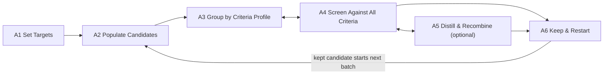
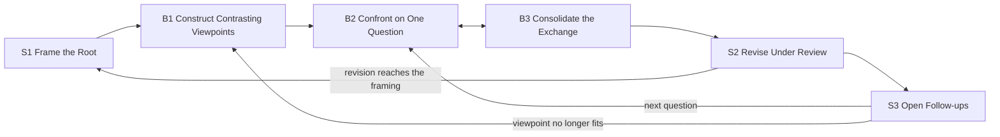
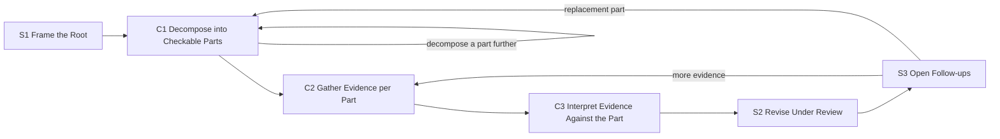

# Pattern Language — MVP (9/22)

> Goal: a minimal pattern language that abstracts the four exemplar systems in `data/` (HALO,
> HAPPIER, PerspectEvolver, THESEUS). Nothing beyond that scope. Source readings:
> `exemplar-systems-review.md`; structure from Borchers (`borchers-translation.md`).
> § numbers refer to each paper's system section.

<!-- <xac: note that i do not assume all the four system papers in data/ fit one pattern. they could be four patterns, or three, or two. patterns are also hierarchical so some of them might share one pattern at workflow but exhibit different patterns at subtasks or components.>
  - Revised twice; now **three workflow patterns**: HALO + HAPPIER share one, PerspectEvolver
    and THESEUS have one each and share three subtasks. See "How the four systems divide". -->

## Structure

Three levels, linked by Borchers's context (up) and references (down):

- **Workflow**: the sequence of subtasks a user performs with the system to achieve the
  high-level task. A workflow can branch and loop.
- **Subtask**: one step in that sequence, for example filter generated ideas. Its solution is a
  sequence of steps in which the user works with components.
- **Component**: a UI element or interaction that supports a subtask.

Every pattern lists its instances. A pattern that appears in one system only is kept and marked
**(1 system)**. The four papers do not have to share every level.

**Level of abstraction.** The name, problem, and solution of a pattern use no term that belongs
to one exemplar system or its domain. Domain terms appear in Examples only. Test: put a system
from another domain in the pattern. Only the Examples change.

**No assumption of AI.** A pattern states what the system does. The four exemplars use AI models
to generate, to score, and to interpret. A pattern also holds when a solver, a database, or a
person produces the content. AI appears in Examples only.

**Writing style.** Pattern text follows ASD-STE100 Simplified Technical English, in the
document-mode form of https://github.com/AminBlg/SimpleEnglish:

- 20 words maximum per instruction. 25 words maximum per description.
- State the condition before the command.
- Use active voice and simple tenses.
- Use *can*, *will*, and *must*. Do not use *should*, *would*, *may*, or *might*.
- Use one word for one meaning in the whole document. The fixed terms are: system, user, item,
  candidate, criterion, group, part, viewpoint, evidence, outcome, record, show, open, select,
  keep, accept, reject, propose, link.
- State the fact, not its importance.
- Two deviations, both deliberate. Field labels (**Problem:**, **Solution:**) stay bold, because
  they are the schema of a pattern and not decoration. A component name keeps its CP number in a
  step, so that a reader can follow the reference.

IDs: workflows `WF-A/B/C` · subtasks `A1…`, `B1…`, `C1…`, shared ones `S1…` · components `CP-1…`.

## Template

| Field | Holds |
|---|---|
| **Name** | A short noun phrase. It is the shared vocabulary item |
| **Level** | workflow, subtask, or component |
| **Context** | The parent patterns that this pattern helps to implement |
| **Problem** | What the user does, and what fails without the pattern |
| **Solution** | How to build the pattern into a design, in terms that hold in any domain. Workflow: a diagram of the subtasks, then one line per subtask. Subtask: the steps in which the user works with named components. Component: what to build, plus a spec (see Components) |
| **Examples** | How each exemplar system instantiates the pattern, with its § section |
| **References** | The child patterns that implement this pattern |

<!-- <xac: need a better language to define this. here solution should describe how to implement this pattern into specific designs in a general tone>
  - Redefined as above. Every Solution below is rewritten as instructions, with the design
    choices named ("Choose…", "Decide…"). -->

<!-- <xac: perhaps defer this attribute? i don't feel like i care about trade-off when viewing a pattern for the first pass>
  - Deferred. Tradeoff is removed from the template and from every pattern; the earlier text is
    in git if a later pass wants it. -->

(Deferred for the MVP: Borchers's tradeoff/forces, diagram, picture, and ranking.)

---

## How the four systems divide

Three workflow patterns. WF-B and WF-C share half of their subtasks. WF-A stands apart.

| | WF-A Guided Candidate Search | WF-B Multi-Viewpoint Refinement | WF-C Decompose and Verify |
|---|---|---|---|
| Systems | HALO, HAPPIER | PerspectEvolver | THESEUS |
| The user works on | a population of candidates | one position, against contrasting viewpoints | one claim, in checkable parts |
| New input comes from | generated candidates and their scores | viewpoints that argue from source material | evidence the user collects outside the system |
| Progress is | fewer candidates, each one stronger | a sharper position, or a named disagreement | evidence per part, and a revised structure |

**Alternatives considered.** One workflow for all four systems puts two different activities in
one shape: to screen a population, and to revise a claim. Two workflows, with PerspectEvolver
and THESEUS together, fail at two subtasks. To form contrasting viewpoints is not to decompose
a claim into parts. A generated argument is not evidence from the world. The split below states
the shared part as three shared subtasks: S1, S2, and S3.

---

## Workflow patterns

### WF-A · Guided Candidate Search
- **Context:** — (top level)
- **Problem:** An expert must find candidates that satisfy several criteria. The space is too
  large to search by hand. Each criterion lives in a separate tool, and the expert checks
  candidates one at a time.
- **Solution:** Support this sequence of subtasks:

  1. A1 Set Targets. The user states the starting point and the criteria.
  2. A2 Populate Candidates. The system generates a batch of candidates from the targets.
  3. A3 Group by Criteria Profile. The system groups candidates by their scores on the criteria.
  4. A4 Screen Against All Criteria. The user checks groups and candidates against every
     criterion.
  5. A5 Distill and Recombine. Optional. The user combines partial successes into new
     candidates. Include this subtask when the domain lets candidates combine.
  6. A6 Keep and Restart. The user keeps survivors. A kept candidate starts the next round.

- **Examples:**

  | Subtask | HALO | HAPPIER |
  |---|---|---|
  | A1 Set Targets | initial molecule and 4 target properties | initial protein, therapeutic impact, ligand |
  | A2 Populate Candidates | generative model, dozens of molecules (§4.1) | interaction graph, 10 subgraphs (§5.1) |
  | A3 Group by Criteria Profile | clusters by improved and worsened properties (§4.1) | subgraphs ranked by interaction potential (§5.1) |
  | A4 Screen Against All Criteria | cluster overview and candidates table with deltas (§4.2) | criteria sliders and detail panel (§5.1–5.2) |
  | A5 Distill and Recombine | intra-cluster and inter-cluster strategies, then the editor (§4.2–4.3) | skipped |
  | A6 Keep and Restart | save, new tree node, next generation (§4.3) | bookmark, personal PPI graph (§5.2.1) |

- **References:** A1–A6.
<!-- <xac: ideally, if two system shares the same workflow, they can both be abstracted as a single "A->B->C->D-> ...">
  - Done: both systems are now one chain, A1 → … → A6. The table shows how each system fills
    each step; HAPPIER skips the optional A5. WF-B uses the same form. -->

### WF-B · Multi-Viewpoint Refinement
- **Context:** — (top level)
- **Problem:** A user develops a position through one framing. People who hold other framings
  are hard to reach. Generated viewpoints read alike and cite nothing.
- **Solution:** Support this sequence of subtasks:

  1. S1 Frame the Root. The user states the position and its basis.
  2. B1 Construct Contrasting Viewpoints. The system builds distinct viewpoints from source
     material. The user keeps a working set.
  3. B2 Confront on One Question. The viewpoints answer one question. Each contribution names
     its viewpoint.
  4. B3 Consolidate the Exchange. The system records what holds, what conflicts, and what stays
     open.
  5. S2 Revise Under Review. That record becomes proposed revisions to the viewpoints and the
     root.
  6. S3 Open Follow-ups. Each unresolved item becomes a proposed next question.

- **Examples:** PerspectEvolver. Investigation Brief (§4.1.1). Literature regions, then
  Perspective Cards with six fields; the user selects 2 or 3 (§4.1.2–4.1.3). Deliberative
  Threads with @-mention, Challenge, and Expand (§4.2.2). Working Synthesis (§4.2.3). Revision
  cards and brief Accept/Edit/Reject (§4.3.1–4.3.2). Suggested Threads (§4.3.3).
- **References:** S1, B1–B3, S2, S3.

### WF-C · Decompose and Verify
- **Context:** — (top level)
- **Problem:** One check does not settle a claim. Evidence arrives one piece at a time. In
  linear notes the user loses which check bears on which part, and why the check ran.
- **Solution:** Support this sequence of subtasks:

  1. S1 Frame the Root. The user states the claim to check.
  2. C1 Decompose into Checkable Parts. The system proposes parts with rationale. The user edits
     the structure.
  3. C2 Gather Evidence per Part. Each part gets a procedure. The user edits it, runs it, and
     reports outcomes.
  4. C3 Interpret Evidence Against the Part. The system reports what the outcome does to that
     part.
  5. S2 Revise Under Review. That reading becomes proposed changes to the structure.
  6. S3 Open Follow-ups. An unresolved part becomes another check or a replacement part.

- **Examples:** THESEUS. Main hypothesis and decomposition depth (§4.1). Sub-hypothesis graph
  with rationale and edge confidence (§4.1). Experiment families, editable protocols, CSV result
  upload (§4.2). Three-reviewer interpretation label (§4.3). Adopt one of three candidates, and
  pending drafts (§4.3–4.4). Further experiment, or replace hypothesis (§4.3).
- **References:** S1, C1–C3, S2, S3.

<!-- <xac: feel like these two systems' connection with each other is looser than halo and happier. esp. 1) THESEUS doesn't really maintain a working artifact; and 2) for B3 and B4, the two systems' instantiations feel quite different. overall i wonder if they belong to different patterns>
  - Agreed, and split: WF-B (PerspectEvolver) and WF-C (THESEUS) are now separate workflows.
    They share three subtasks (S1, S2, S3) and nine components, which is where the real overlap
    was. "Evolving Working Artifact" survives only as CP-4 Persistent Structure Map. -->

<!-- <xac: WF-B&C's level of abstraction seems lower (more specific) than WF-A, which i feel has the appropriate amount of generalizability balanced with groundedness (in the example papers)>
  - Fixed. Both were written in their one system's vocabulary ("perspective", "hypothesis",
    "experiment"). Raised to WF-A's level, and the rule is stated under "Structure": no term
    from one exemplar or its domain outside the Examples field. -->

<!-- <xac: just want to re-iterate that we do not assume workflow is linear: it can branch out and it can form loops (a mermaid diagram is better suited for describing it in general?)>
  - Adopted: each workflow's Solution now leads with a mermaid flowchart showing branches and
    loops, with the numbered list as the reading order. -->

---

## Shared subtasks (WF-B and WF-C)

### S1 · Frame the Root
- **Context:** WF-B, WF-C
- **Problem:** The user holds the position or the claim in mind. Later work drifts. No
  contribution can be checked against the intent of the user.
- **Solution:**
  1. Show an Inquiry Frame (CP-1). Give it one field per aspect of the root.
  2. The user fills the fields. The system can draft a field. The user edits the draft.
  3. Keep the frame visible. Every later subtask reads it as context.
  4. When later work implies a change to the root, show a Reviewable Revision (CP-11).
  5. The frame changes when the user accepts the revision, and at no other time.
- **Examples:** PerspectEvolver Investigation Brief: problem, framing, previous work,
  methodology, and expected results. It stays editable, and revisions arrive through
  Accept/Edit/Reject (§4.1.1, §4.3.2). THESEUS main hypothesis and decomposition depth (§4.1).
- **References:** CP-1 Inquiry Frame, CP-11 Reviewable Revision.

<!-- <xac: there is an assumption here that this is for interacting with AI?>
  - Removed. The language is now AI-neutral: patterns say "the system". See "No assumption of
    AI" under Structure. -->

<!-- <xac: the description here lack operationalizability; it should consists of steps where the user interacts with certain patterns of components to accomplish this subtask>
  - Adopted. Every subtask Solution below is now numbered steps, each naming the components
    (CP-n) the user works with. -->

### S2 · Revise Under Review
- **Context:** WF-B, WF-C
- **Problem:** When the system edits the work directly, the user loses control and cannot see
  the change. When the system drafts nothing, the user gains little.
<!-- <xac: language like this seems too casual, mystic, and imprecise. check this and see if we can adopt its style: https://github.com/AminBlg/SimpleEnglish>
  - Adopted, document mode, for all pattern text: 20-word instructions, condition before
    command, active voice, no should/would/may/might, one word per meaning, fact not importance.
    The rules and the two deviations are under "Writing style". -->
- **Solution:**
  1. Take what the previous subtask established. Draft the revisions it implies. Apply nothing.
  2. When one change is implied, show a Reviewable Revision (CP-11): before, after, and the
     reason.
  3. When several directions are open, show a Proposal Set (CP-10). Label each option and give
     its rationale.
  4. The user accepts, edits, or rejects each item. Only this action changes the state.
  5. Keep the replaced content. Link it to its successor with a Provenance Link (CP-14).
  6. When the item changed after the system drafted the revision, reject the draft.
- **Examples:** PerspectEvolver revision cards and brief Accept/Edit/Reject. Participants
  accepted 70% as drafted, edited 28%, and rejected 2% (§4.3.1–4.3.2). THESEUS adopts one
  candidate of three. It rejects a pending draft when the graph changed under it (§4.3–4.4).
- **References:** CP-10 Proposal Set, CP-11 Reviewable Revision, CP-14 Provenance Link.

### S3 · Open Follow-ups
- **Context:** WF-B, WF-C
- **Problem:** A round ends with a disagreement or an inconclusive outcome. The user stops, or
  the item is lost.
- **Solution:**
  1. Collect the items that the round left unresolved.
  2. Show each item as a Suggested Next Step (CP-13). Leave the items unopened.
  3. Give each item a Provenance Link (CP-14) to the item that raised it.
  4. When the user opens one item, re-enter the workflow at the subtask that item needs.
- **Examples:** PerspectEvolver builds Suggested Threads from open questions, and shows them as
  prospective canvas branches (§4.3.3). THESEUS offers three candidates each for "replace
  hypothesis" and "further experiment" (§4.3).
- **References:** CP-13 Suggested Next Steps, CP-14 Provenance Link.

---

## Subtasks — WF-A · Guided Candidate Search

### A1 · Set Targets
- **Context:** WF-A
- **Problem:** Generation and screening need the criteria. The criteria live in the notes of the
  expert, or in separate tools.
- **Solution:**
  1. Show an Inquiry Frame (CP-1): the starting point, and one field per criterion.
  2. Use the format of the domain for each field.
  3. The user fills each field. Flag a field that a later subtask requires.
  4. Keep the targets visible. A2, A3, and A4 read them.
- **Examples:** HALO: initial molecule and four target properties. HAPPIER: initial protein,
  therapeutic impact, and ligand, one input per criterion (§5.1).
- **References:** CP-1 Inquiry Frame.

### A2 · Populate Candidates
- **Context:** WF-A
- **Problem:** Manual search stays near familiar options, and it is slow.
- **Solution:**
  1. The user requests candidates from the current targets.
  2. The system returns a Candidate Batch (CP-2), not one answer.
  3. Size the batch so that the groups in A3 stay legible.
  4. Put each candidate on the Persistent Structure Map (CP-4) with a Provenance Link (CP-14).
  5. The user edits the targets and requests another batch.
- **Examples:** HALO generates dozens of molecules and puts them on the trajectory map (§4.1).
  HAPPIER splits the interaction graph into 10 subgraphs of 50 to 60 proteins (§5.1).
- **References:** CP-2 Candidate Batch, CP-4 Persistent Structure Map, CP-14 Provenance Link.

### A3 · Group by Criteria Profile
- **Context:** WF-A
- **Problem:** A flat list of hundreds of candidates hides which candidates behave alike.
- **Solution:**
  1. Choose a grouping signature from the criteria, not from the generation order.
  2. Form Candidate Groups (CP-3). Label each group and summarize it.
  3. Show the groups on the Persistent Structure Map (CP-4).
  4. The user opens one group to list its candidates.
- **Examples:** HALO clusters candidates by improved and worsened properties, in green and red
  (§4.1). HAPPIER ranks subgraphs by interaction potential, and a slider switches between them
  (§5.1).
- **References:** CP-3 Candidate Groups, CP-4 Persistent Structure Map.

### A4 · Screen Against All Criteria
- **Context:** WF-A
- **Problem:** The user checks each candidate against each criterion in a separate tool. A
  generated score can be wrong.
- **Solution:**
  1. Show every criterion on one view with Multi-Criteria Encoding (CP-5).
  2. Give each criterion one visual channel and one toggle.
  3. Show the score of each candidate in place. When the system generated the score, add a
     Confidence Cue (CP-8).
  4. When the user selects a candidate, open Detail on Demand (CP-6) with its Attached Evidence
     (CP-7).
  5. The user rejects candidates, then returns to A3 for the next group.
- **Examples:** HALO shows property deltas and a sortable candidates table (§4.2). HAPPIER shows
  criteria sliders, edge and node encoding, and a detail panel with papers and docking poses
  (§5.1–5.2).
- **References:** CP-5 Multi-Criteria Encoding, CP-6 Detail on Demand, CP-7 Attached Evidence,
  CP-8 Confidence Cue.

### A5 · Distill and Recombine **(1 system)**
- **Context:** WF-A
- **Problem:** Each group passes some criteria and fails others. The expert must find the cause,
  and must combine partial successes.
- **Solution:**
  1. For each group, report what its candidates share, and what corrects the failed criteria.
  2. Show these as a Proposal Set (CP-10), within one group and across groups.
  3. When the user applies an option, edit the candidate and run Live Consequence Preview
     (CP-15).
  4. Show the gain and the loss on every criterion after each edit.
  5. When the user has a direction, reduce the number of open options.
  6. On save, create a candidate with a Provenance Link (CP-14) to its source.
- **Examples:** HALO MolStrategy gives strategies within a cluster. MolSynthesis gives strategies
  across clusters. Property scores update live, and a save adds a node with an edit edge
  (§4.2–4.3). Participants called the late-session strategy list too long (§5.2.3).
- **References:** CP-10 Proposal Set, CP-14 Provenance Link, CP-15 Live Consequence Preview.

### A6 · Keep and Restart
- **Context:** WF-A
- **Problem:** Kept candidates spread across views. The next round starts from nothing.
- **Solution:**
  1. Give every candidate a keep action that adds it to a Shortlist (CP-12).
  2. Show the shortlist as its own view. It is the deliverable.
  3. The user filters the shortlist by group.
  4. Keep the Provenance Link (CP-14) on each kept candidate.
  5. The user sends a kept candidate to A2 as the next starting point.
- **Examples:** HAPPIER bookmarks build a personal PPI graph, filterable by subgraph (§5.2.1).
  HALO saves a candidate as a node on the trajectory tree. That node starts the next generation
  (§4.3).
- **References:** CP-12 Shortlist, CP-14 Provenance Link.

---

## Subtasks — WF-B · Multi-Viewpoint Refinement

### B1 · Construct Contrasting Viewpoints
- **Context:** WF-B
- **Problem:** A viewpoint requested in one sentence reads like every other viewpoint. The user
  cannot tell what each viewpoint contributes.
- **Solution:**
  1. Retrieve source material for the root. Form Candidate Groups (CP-3) from it.
  2. Build one viewpoint per group. Give every viewpoint the same fields.
  3. Attach evidence to each field with Attached Evidence (CP-7). Link the evidence to its
     source passage.
  4. The user compares viewpoints field by field, then keeps a working set (Shortlist, CP-12).
  5. Show the working set on the Persistent Structure Map (CP-4).
- **Examples:** PerspectEvolver maps about 1,370 retrieved papers into regions. It builds one
  Perspective Card per region, with six fields. The user selects 2 or 3 (§4.1.2–4.1.3).
- **References:** CP-3 Candidate Groups, CP-4 Persistent Structure Map, CP-7 Attached Evidence,
  CP-12 Shortlist.

### B2 · Confront on One Question
- **Context:** WF-B
- **Problem:** In one long conversation the viewpoints blur. The user cannot tell which
  viewpoint produced a conclusion.
- **Solution:**
  1. The user opens a Scoped Conversation (CP-9) for one question, and names the participants.
  2. Attribute each contribution to its viewpoint, and to the contribution it answers.
  3. Attach evidence to each empirical claim (CP-7).
  4. The user addresses one participant, adds a participant, challenges a passage, or requests
     more turns.
  5. Keep one exchange per question.
- **Examples:** PerspectEvolver Deliberative Threads: attribution per contribution, @-mention,
  Quote response, Challenge, Expand, and 1 to 6 turns per request (§4.2.2).
- **References:** CP-7 Attached Evidence, CP-9 Scoped Conversation.

### B3 · Consolidate the Exchange
- **Context:** WF-B
- **Problem:** A finished exchange is long. The user must read it again to find what it settled.
- **Solution:**
  1. The user requests a record of the exchange.
  2. Record three things: what holds, what conflicts, and what stays open.
  3. Link each entry to its contributions and evidence. The user opens them with Detail on
     Demand (CP-6).
  4. Keep a conflict as a conflict. S3 uses it.
  5. The user continues the exchange and requests another record. Keep both records.
- **Examples:** PerspectEvolver Working Synthesis records the hypothesis, insights, agreements,
  disagreements, and open questions, with literature links. The user can synthesize the thread
  again (§4.2.3).
- **References:** CP-6 Detail on Demand, CP-7 Attached Evidence.

---

## Subtasks — WF-C · Decompose and Verify

### C1 · Decompose into Checkable Parts
- **Context:** WF-C
- **Problem:** The user cannot check a broad claim in one step. A flat list of parts hides which
  part a check bears on.
- **Solution:**
  1. Propose a hierarchy of parts from the root. Make each part a checkable statement.
  2. Give each part typed fields: what varies, what is measured, and what is assumed.
  3. Put the hierarchy on the Persistent Structure Map (CP-4). State what a node and an edge
     mean.
  4. Attach the rationale and the sources to each parent-child link (CP-7). Add a Confidence Cue
     (CP-8).
  5. When the user selects a part, open Detail on Demand (CP-6) and a Scoped Conversation
     (CP-9).
  6. The user edits parts, adds parts, and requests a further decomposition of one part.
- **Examples:** THESEUS builds a sub-hypothesis graph with typed fields, a decomposition
  rationale with literature, and a confidence score per edge. It decomposes an approved leaf
  further on request (§4.1).
- **References:** CP-4 Persistent Structure Map, CP-6 Detail on Demand, CP-7 Attached Evidence,
  CP-8 Confidence Cue, CP-9 Scoped Conversation.

### C2 · Gather Evidence per Part
- **Context:** WF-C
- **Problem:** A drafted procedure does not match the setting of the user. A free-text outcome
  loses the conditions that produced it.
- **Solution:**
  1. Attach a procedure to each part that it checks.
  2. State in advance which outcome supports the part, which weakens it, and which leaves it
     open.
  3. Keep every field of the procedure editable, before the user runs it and after.
  4. Support variants of one procedure for different settings.
  5. When more than one procedure fits, show a Proposal Set (CP-10).
  6. The user reports outcomes with Structured Result Entry (CP-16). Check that the report
     covers every part.
  7. Attach the outcome to one procedure. A variant does not inherit it.
- **Examples:** THESEUS creates experiment families with variants, editable step-by-step
  protocols, and expected patterns. It verifies the CSV upload against the experiment package
  (§4.2).
- **References:** CP-10 Proposal Set, CP-16 Structured Result Entry.

### C3 · Interpret Evidence Against the Part
- **Context:** WF-C
- **Problem:** A weak or negative outcome does not state what it means for the claim. A global
  reinterpretation disturbs the parts that the outcome did not touch.
- **Solution:**
  1. Interpret the outcome against the part that its procedure checked.
  2. Report one verdict: supported, not supported, or unresolved.
  3. Keep the reasoning beside the verdict (CP-7). Add a Confidence Cue (CP-8).
  4. The user opens Detail on Demand (CP-6), reads the reasoning, and contests the verdict.
  5. Change nothing else here. S2 applies the consequences.
- **Examples:** THESEUS runs three reviewers, for evidence, validity, and scope. Their votes
  produce one approved or not-approved label with a rationale, for that experiment and
  hypothesis pair (§4.3).
- **References:** CP-6 Detail on Demand, CP-7 Attached Evidence, CP-8 Confidence Cue.

---

## Components

**Used by more than one workflow:** CP-1, CP-3, CP-4, CP-6, CP-7, CP-8, CP-9, CP-10, CP-12,
CP-14.

**Spec** links an abstract representation of the component: an element tree with data bindings,
variations, and events. A spec states what the design needs, and it states no style. It is
independent of any renderer: a rendering library is a way to look at a spec, and it constrains
nothing. Specs are in `refs/component-specs.md`.

<!-- <xac: the solution at this level of hierarchy can be an abstract representation of UI(s), e.g., a wireframe or styleless HTML. try linking 3 CPs to such representations> -->
<!-- <xac: follow-up on representation of components: let's use a DOM-tree like config kind of spec that can be on-demand sent to generative UI tools like A2UI to render a concrete example. check ~/dev/maui/ which adopts such an approach so we don't have to worry about style etc. >
  - Done. The three styleless-HTML sketches are replaced by specs in the maui pattern
    mini-language: `Component #id`, `@/path` binding, `?state` variation, `*@/path` repeat,
    `-> event`, and `fallback:`. Specs are in `refs/component-specs.md`; the HTML files are deleted.
    Two gains over the HTML: a spec names its variations (`states:`) and its events, so the
    variations a component must support are stated, not implied. Tell me to do the other 13. -->

| ID | Name | Context | Problem | Solution | Spec | Examples |
|---|---|---|---|---|---|---|
| CP-1 | **Inquiry Frame** | A1, S1 | The goal and the criteria stay in the mind of the user | Give the goal and each criterion a typed field. Keep the fields visible. Later subtasks read them and propose edits to them | [spec](refs/component-specs.md#cp-1--inquiry-frame) | HAPPIER 3 inputs; HALO targets; PerspectEvolver brief; THESEUS root node |
| CP-2 | **Candidate Batch** | A2 | One answer anchors the thinking of the user | Return N candidates per request. Size N so that the groups stay legible | — | HALO generator; HAPPIER subgraphs |
| CP-3 | **Candidate Groups** | A3, B1 | Too many items to read one by one | Choose a signature from the criteria or the sources. Group by it. Label and summarize each group | — | HALO clusters; HAPPIER subgraphs; PerspectEvolver literature regions |
| CP-4 | **Persistent Structure Map** | A2, A3, B1, C1 | A linear transcript loses the structure of the work | Make a tree, graph, or canvas the working state. Put new items in it. State what a node and an edge mean | — | HALO trajectory map; HAPPIER graph; PerspectEvolver canvas; THESEUS graph |
| CP-5 | **Multi-Criteria Encoding** | A4 | The user checks each criterion in a separate tool | Give each criterion one visual channel on one view, and one toggle | — | HAPPIER edge width, edge color, node color; HALO green and red per property |
| CP-6 | **Detail on Demand** | A4, B3, C1, C3 | All the evidence at once overloads the user | Show a summary in place. On selection, open the full evidence in a panel | [spec](refs/component-specs.md#cp-6--detail-on-demand) | HAPPIER detail panel; THESEUS evidence panel; HALO cluster tabs |
| CP-7 | **Attached Evidence** | A4, B1, B2, B3, C1, C3 | An explanation apart from what it justifies is hard to find and to check | Store the rationale and the sources on the item or the link that they justify. Open them from there | — | THESEUS node and edge rationale; PerspectEvolver per-field evidence; HAPPIER papers per PPI; HALO cluster explanation |
| CP-8 | **Confidence Cue** | A4, C1, C3 | The user cannot tell which claims to check | Show a score beside each generated claim or link. State what the score measures | — | THESEUS edge confidence; HAPPIER therapeutic score, binding affinity |
| CP-9 | **Scoped Conversation** | B2, C1 | A conversation over the whole workspace changes items that the user keeps | Open the conversation from a selected item. Give it that item and its neighbors. Hold its edits as proposals | — | PerspectEvolver threads, select then Challenge or Expand; THESEUS node drawer |
| CP-10 | **Proposal Set** | A5, C2, S2, S3 | One suggestion hides the alternatives | Show a few labelled options, each one with its rationale. The user applies one option | — | HALO strategy list; THESEUS 3 candidates; PerspectEvolver proposals |
| CP-11 | **Reviewable Revision** | S1, S2 | The user cannot see what an edit changed | Show before and after per field, with the reason. Offer accept, edit, and reject | [spec](refs/component-specs.md#cp-11--reviewable-revision) | PerspectEvolver revision cards and brief diff; THESEUS pending drafts |
| CP-12 | **Shortlist** | A6, B1 | Kept items spread across views | Give a keep action. It adds the item to a separate view. That view is the deliverable | — | HAPPIER bookmark graph; PerspectEvolver Keep/Skip |
| CP-13 | **Suggested Next Steps** | S3 | The user stops after a round | Build next units from the unresolved items. Show them unopened | — | PerspectEvolver suggested threads; THESEUS follow-up directions |
| CP-14 | **Provenance Link** | A2, A5, A6, S2, S3 | A new item loses its origin | Link each new or revised item to what produced it. Keep what it replaced | — | HALO edit edge; PerspectEvolver "why this changed"; THESEUS replaced hypothesis keeps prior experiments |
| CP-15 | **Live Consequence Preview** (1 system) | A5 | The user cannot judge an edit without its effect | Recompute the criteria after each edit. Show the gain and the loss at once | — | HALO property deltas in the editor |
| CP-16 | **Structured Result Entry** (1 system) | C2 | A free-text outcome loses conditions and replicates | Give a template tied to the procedure: conditions, replicates, notes. Check coverage on entry | — | THESEUS CSV per experiment |

## Check: does the language abstract all four systems?

| System | Workflow | Subtasks | Components |
|---|---|---|---|
| HALO | WF-A | A1–A6 | CP-1–CP-8, CP-10, CP-14, CP-15 |
| HAPPIER | WF-A | A1–A4, A6 (no A5) | CP-1–CP-8, CP-12, CP-14 |
| PerspectEvolver | WF-B | S1, B1–B3, S2, S3 | CP-1, CP-3, CP-4, CP-6, CP-7, CP-9–CP-14 |
| THESEUS | WF-C | S1, C1–C3, S2, S3 | CP-1, CP-4, CP-6–CP-11, CP-13, CP-14, CP-16 |

**Open for your judgment.**
- HALO and HAPPIER differ at A5. The two can be an optimization variant and a screening variant
  of WF-A, and not one workflow.
- WF-B and WF-C each rest on one system. A system outside `data/` must confirm them.
