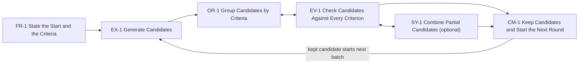

## Solution

Support this sequence of subtasks:

1. FR-1 State the Start and the Criteria. The user gives the starting point and each criterion.
2. EX-1 Generate Candidates. The system returns a batch of candidates from the criteria.
3. OR-1 Group Candidates by Criteria. The system groups candidates by their scores.
4. EV-1 Check Candidates Against Every Criterion. The user checks groups and candidates.
5. SY-1 Combine Partial Candidates. Optional. Include it when the domain lets candidates combine.
6. CM-1 Keep Candidates and Start the Next Round. A kept candidate starts the next round.

## Examples

Built from the subtask Examples: the site shows one table per system, a row per subtask.
