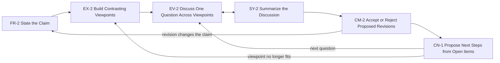

## Solution

Support this sequence of subtasks:

1. FR-2 State the Claim. The user states the claim and its basis.
2. EX-2 Build Contrasting Viewpoints. The system builds viewpoints from source material. The
   user keeps a working set.
3. EV-2 Discuss One Question Across Viewpoints. Each contribution names its viewpoint.
4. SY-2 Summarize the Discussion. The system records what holds, what conflicts, and what stays
   open.
5. CM-2 Accept or Reject Proposed Revisions. The record becomes proposed revisions to the
   viewpoints and the claim.
6. CN-1 Propose Next Steps from Open Items. Each open item becomes a proposed next question.

## Examples

Built from the subtask Examples: the site shows one table per system, a row per subtask.
