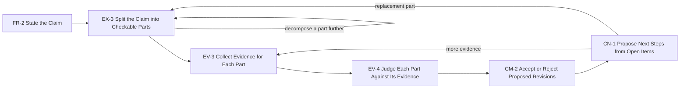

## Solution

Support this sequence of subtasks:

1. FR-2 State the Claim. The user states the claim to check.
2. EX-3 Split the Claim into Checkable Parts. The system proposes parts with rationale. The user
   edits the structure.
3. EV-3 Collect Evidence for Each Part. The user edits a procedure per part, runs it, and reports
   outcomes.
4. EV-4 Judge Each Part Against Its Evidence. The system reports what the outcome does to that
   part.
5. CM-2 Accept or Reject Proposed Revisions. The judgement becomes proposed changes to the parts.
6. CN-1 Propose Next Steps from Open Items. An open part becomes another check or a replacement
   part.

## Examples

Built from the subtask Examples: the site shows one table per system, a row per subtask.
